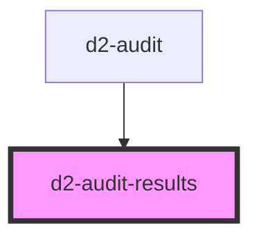

# d2-audit-results

<!-- Auto Generated Below -->

## Properties

| Property | Attribute | Description | Type                          | Default     |
| -------- | --------- | ----------- | ----------------------------- | ----------- |
| `brand`  | `brand`   |             | `string`                      | `'dove'`    |
| `tree`   | --        |             | `BitbucketRepoTreeJsonType[]` | `undefined` |

## Dependencies

### Used by

 - [d2-audit](../d2-audit)

### Graph

----------------------------------------------

*Built with [StencilJS](https://stenciljs.com/)*
