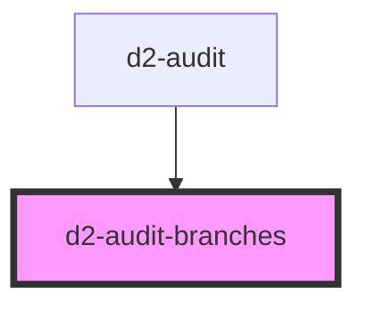

# d2-audit-results

<!-- Auto Generated Below -->

## Properties

| Property  | Attribute | Description | Type     | Default                     |
| --------- | --------- | ----------- | -------- | --------------------------- |
| `project` | `project` |             | `string` | `'d2_website_repositories'` |
| `repo`    | `repo`    |             | `string` | `undefined`                 |

## Events

| Event          | Description | Type               |
| -------------- | ----------- | ------------------ |
| `changebranch` |             | `CustomEvent<any>` |

## Dependencies

### Used by

 - [d2-audit](../d2-audit)

### Graph

----------------------------------------------

*Built with [StencilJS](https://stenciljs.com/)*
