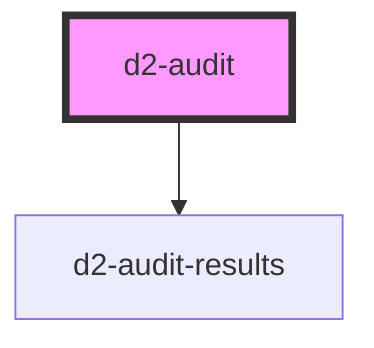

# d2-audit

<!-- Auto Generated Below -->

## Properties

| Property  | Attribute  | Description | Type     | Default            |
| --------- | ---------- | ----------- | -------- | ------------------ |
| `branch`  | `branch`   |             | `string` | `undefined`        |
| `brand`   | `brand`    |             | `string` | `'axe'`            |
| `repo`    | `repo`     |             | `string` | `undefined`        |
| `treeUrl` | `tree-url` |             | `string` | `DEFAULT_TREE_URL` |

## Dependencies

### Depends on

- [d2-audit-results](../d2-audit-results)

### Graph

----------------------------------------------

*Built with [StencilJS](https://stenciljs.com/)*
