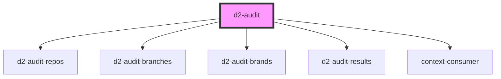

# d2-audit

<!-- Auto Generated Below -->

## Properties

| Property  | Attribute | Description | Type     | Default                     |
| --------- | --------- | ----------- | -------- | --------------------------- |
| `branch`  | `branch`  |             | `string` | `'develop'`                 |
| `brand`   | `brand`   |             | `string` | `undefined`                 |
| `project` | `project` |             | `string` | `'d2_website_repositories'` |
| `repo`    | `repo`    |             | `string` | `undefined`                 |

## Dependencies

### Depends on

- [d2-audit-repos](../d2-audit-repos)
- [d2-audit-branches](../d2-audit-branches)
- [d2-audit-brands](../d2-audit-brands)
- [d2-audit-results](../d2-audit-results)
- context-consumer

### Graph

----------------------------------------------

*Built with [StencilJS](https://stenciljs.com/)*
